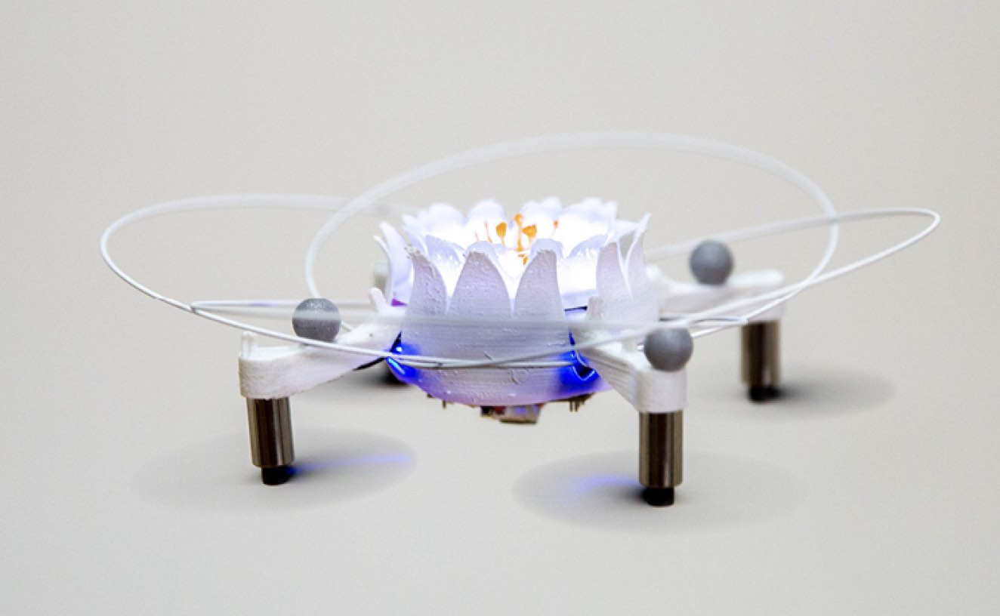

# Drone Chi
## Description:
Turn your crazyflie into something akin to a lotus flower. This project contains the neccesary parts to replicate the project Drone Chi. (https://www.youtube.com/watch?v=ukXf9_ZCNZw)

## Reccomendations
- The parts were printed in tough PLA on an ultimaker 3. 
- Print many spares, these tings are tricky to assemble
- 0.8mm carbon rod was used for the prop guards. (https://www.hyperflight.co.uk/products.asp?code=CARBON-ROD-08MM)
- .5mm carbon rod breaks too easily and 1mm carbon rod is too strong and splits open the model
- The arms need to printed with PVA support material then placed in a big jar of water to be dissolved. Dissolving is faster if the water is change regularly, is agitated and is warm. I used a magnetic stirrer with the heat on low to get the PVA out of the tiny nooks in about 4 hours. 

NOTE: the project requires the drone to be flying upside down such that the LED deck is facing up. See the following forum post for thr for the firmware changes (https://forum.bitcraze.io/viewtopic.php?p=16649#p16649)

## Parts List:
- 4x 20190414_025_FDRN_Arm_A_Inverted_7mm_motors_8mm_markers_reinforced
- 2x 20190423_finger_toggle_elliptical
- 2x 20190423_hand_pad
- 1x 20190417_028_FDRN_Centre_Piece.STL
- 1x 20190419_031_FDRN_Centre_Shroud_Lotus_CF2.STL
- 1x the stamen of an artificial flower
- 1x crazyflie 2.0 or 2.1
- 4x 400mm .8mm carbon rods. MUST BE .8mm

